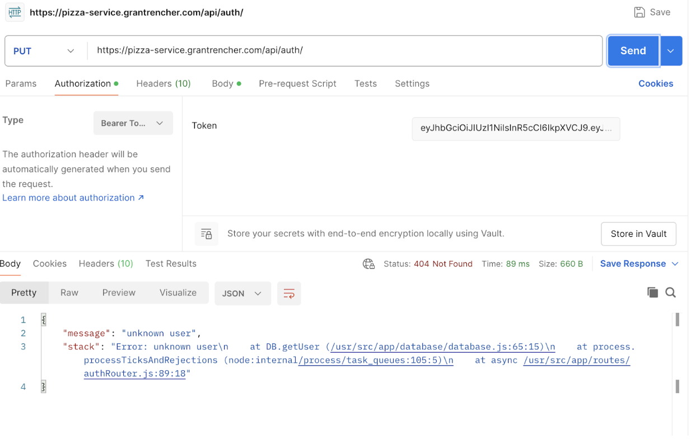
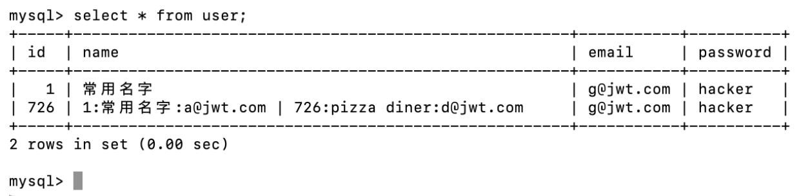
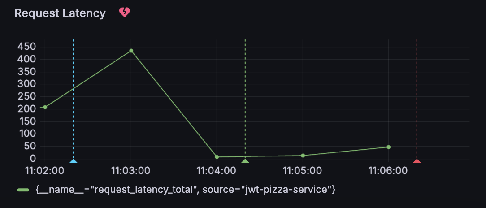
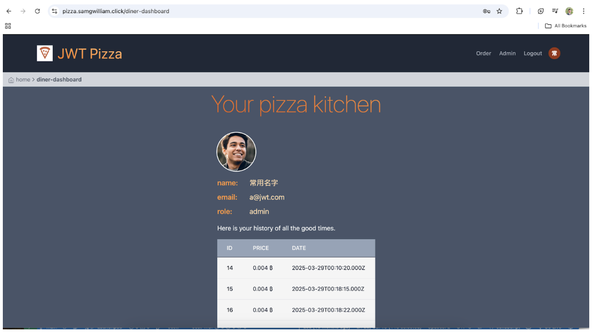
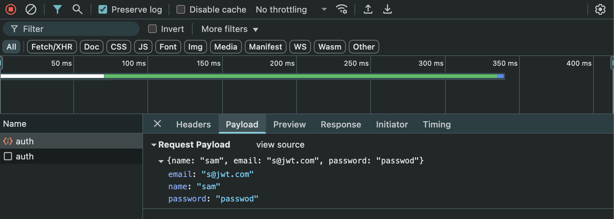

# 🔐 Self Attacks

## Grant – Self Attack

| Item               | Result                                                                                                                                                                                                                                                                                                                                                    |
| ------------------ | --------------------------------------------------------------------------------------------------------------------------------------------------------------------------------------------------------------------------------------------------------------------------------------------------------------------------------------------------------- |
| **Date**           | April 10, 2025                                                                                                                                                                                                                                                                                                                                            |
| **Target**         | `pizza.grantrencher.com` / `pizza-service.grantrencher.com`                                                                                                                                                                                                                                                                                               |
| **Classification** | Injection                                                                                                                                                                                                                                                                                                                                                 |
| **Severity**       | 2                                                                                                                                                                                                                                                                                                                                                         |
| **Description**    | SQL injection caused all passwords to be changed to the unencrypted string `hacker`. This prevented all users from logging in. The first screenshot shows an error message confirming the query was executed (since the error occurs after the query). The second screenshot shows the same result in the local database—both passwords were overwritten. |
| **Images**         |                                                                                                                                                                                                                                                                                 |
| **Corrections**    | Sanitize user input                                                                                                                                                                                                                                                                                                                                       |

---

## Sam – Self Attack

| Item               | Result                                                                                                                                                                                                                         |
| ------------------ | ------------------------------------------------------------------------------------------------------------------------------------------------------------------------------------------------------------------------------ |
| **Date**           | April 10, 2025                                                                                                                                                                                                                 |
| **Target**         | `https://pizza.samgwilliam.click`                                                                                                                                                                                              |
| **Classification** | DOS / Software Logging Failure                                                                                                                                                                                                 |
| **Severity**       | 4                                                                                                                                                                                                                              |
| **Description**    | Attempted denial of service attack by overloading the server with requests. Tried to hide malicious activity by flooding the logs with legitimate-looking requests. Injection attempts were buried unless carefully inspected. |
| **Images**         |                                                                                                                                                                                             |
| **Corrections**    | AWS was scaled to handle the DOS attack. Improve logging so suspicious or failed requests stand out more clearly.                                                                                                              |

---

# 🤝 Peer Attacks

## Grant Attack on Sam

| Item               | Result                                                                            |
| ------------------ | --------------------------------------------------------------------------------- |
| **Date**           | April 10, 2025                                                                    |
| **Target**         | `https://pizza.samgwilliam.click/`                                                |
| **Classification** | Security Misconfiguration                                                         |
| **Severity**       | 3                                                                                 |
| **Description**    | Default admin credentials were still enabled, allowing unauthorized admin access. |
| **Images**         |                                              |
| **Corrections**    | Change default admin login credentials.                                           |

---

## Sam Attack on Grant

| Item               | Result                                                                                                       |
| ------------------ | ------------------------------------------------------------------------------------------------------------ |
| **Date**           | April 10, 2025                                                                                               |
| **Target**         | `https://pizza.grantrencher.com/`                                                                            |
| **Classification** | Cryptographic Failure                                                                                        |
| **Severity**       | 2                                                                                                            |
| **Description**    | User information was sent in plaintext over HTTP. A man-in-the-middle attack could intercept sensitive data. |
| **Images**         |                                                                           |
| **Corrections**    | Encrypt sensitive information before transmission (e.g., enforce HTTPS, secure cookies, and headers).        |

---

# 📘 Combined Summary of Learnings

## Sam

In this assignment I learned the potential difficulty of exploiting another’s application if proper security measures have been taken. The low-hanging fruit attack would have been to try a SQL injection attack with input fields. Since they were parameterized/sanitized that made a SQL injection attack difficult. I also learned that vulnerabilities might not necessarily lead to an attack on your website but an attack on your users. For example, the registration payloads were left unencrypted and a competent man in the middle attack would compromise their passwords. Penetration testing on your own site as well as other sites can lead to vulnerability discovery that you wouldn’t have found before.

---

## Grant

I learned that when securing an application you need to be very careful that all vulnerabilities are covered. Hackers won’t leave any stone unturned when they attack your site. We found pages and endpoints that weren’t as secure as they should have been. While their access didn’t cause major security vulnerabilities, viewing them could give hints to hackers that they could use in other attack methods. I also learned that penetration testing is a valuable tool. This type of testing allows you to stand in the shows of the hacker and attack your site. This opened my eyes that there is a lot to learn about penetration testing and that it is very useful in building applications.
